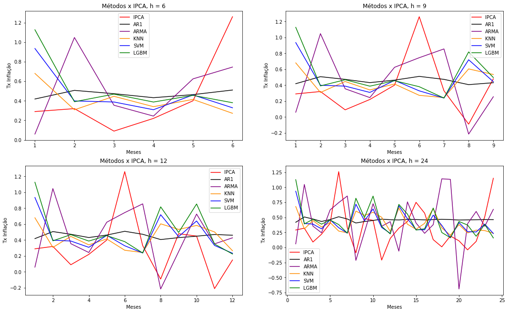

*Código feito originalmente em R.*

## Introdução

O estudo sobre inflação no Brasil é um tema recorrente, tanto pelo histórico de alta inflação e planos de estabilização malsucedidos, quanto por ser um país emergente que, em regra, são países que possuem taxas de inflação menos controladas do que as de países desenvolvidos.

Um outro motivo para se analisar a inflação tem a ver com o aumento de técnicas computacionais robustas em tarefas de previsão, como os modelos de `machine learning`. Com a revolução na ciência de dados, os economistas passaram a incorporar cada vez mais esses novos algoritmos em suas pesquisas. 

Dessa forma, foram usados tanto técnicas mais tradicionais de previsão, como os modelos de séries temporais, assim como modelos de machine learning, para prever o índice oficial de inflação do Brasil (IPCA). 
  

## Metodologia
Os dados dentro da amostra abrangem um período mensal de janeiro de 2006 até dezembro de 2017, sendo que 70% das observações correspondem aos dados de treino, enquanto os outros 30% são os dados de teste. 

A previsão fora da amostra engloba os anos de 2018 e 2019, com horizontes de previsão para 6,9,12 e 24 meses (h=6,...,24).

As técnicas de séries temporais usadas foram o **AR (1)** e o **ARMA (4,3)**, enquanto as de machine learning foram as de **KNN**, **SVM** e **Light GBM**. Como tradicionalmente é feito, o modelo AR (1) foi escolhido como benchmark.

Os critérios de comparação usados foram os erros MSE e RMSE, e as previsões foram posteriormente testadas em pares através do teste de Diebold-Mariano para saber se essas diferenças têm alguma significância estatística.
  

## Resultados
A análise gráfica ajuda a entender o desempenho dos modelos contra o IPCA.   

  
A tabela abaixo sintetiza os erros de previsão encontrados pelos modelos para todos os horizontes.

Ao comparar os erros, fica evidente que os modelos de machine learning, mais especificamente o SVM e o Light GBM, conseguem bons resultados até 12 meses, se comparados com os modelos de séries temporais. Mas, para o horizonte de 24 meses, o benchmark alcança um desempenho melhor do que todos os modelos. Na realidade, esse resultado já é conhecido no estudo de previsão da inflação brasileira, como já evidenciado por outros autores.

Por último, também foi realizado um teste estatístico de Diebold-Mariano para saber se essas diferenças apresentadas na tabela são significativas em termos estatísticos. O que se concluiu foi que, considerando um nível de significância de 5%, na maioria dos casos os modelos não diferem entre si em termos estatísticos.

## Referências

Esse trabalho foi originalmente criado como a minha dissertação de mestrado, e foi desenvolvido na linguagem de programação R. 

## Outras leituras
#### Sobre machine learning e economia
[Big Data: New Tricks for Econometrics](https://www.aeaweb.org/articles?id=10.1257/jep.28.2.3) 

[Machine Learning Methods Economists Should Know About](https://arxiv.org/pdf/1903.10075) 

#### Sobre previsão de inflação para o Brasil
[Forecasting Brazilian Inflation with High-Dimensional Models](https://periodicos.fgv.br/bre/article/view/52273) 

[Machine learning methods for inflation forecasting in Brazil: New contenders versus classical models](https://www.bcb.gov.br/pec/wps/ingl/wps561.pdf)

